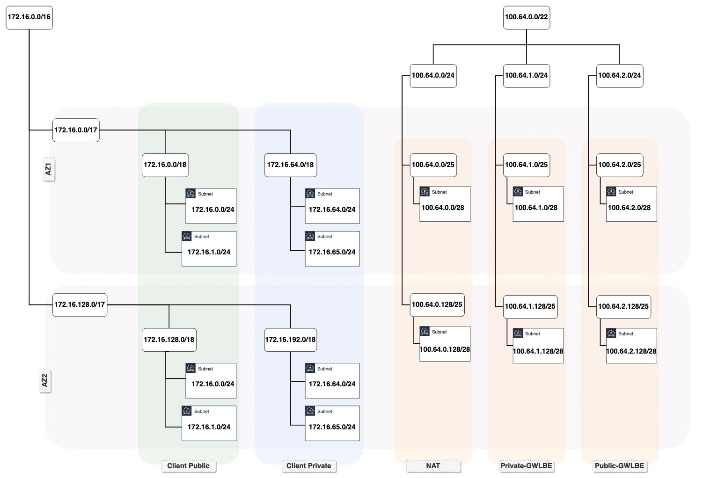

# lab-aws-gwlb-vpc
<br><br>

## Info
The following project deploys VPC that can be integrated with a centralized Traffic Inspection account via GWLB and PrivateLink.

Solution accepts config file (_json_ or _yaml_ format) and allows to customize:

- [ ] number of availability zones 
- [ ] CIDR for Client subnets
- [ ] number of client public subnets per AZ (_zero_ is also accepted) 
- [ ] number of client private subnets per AZ (_zero_ is also accepted)

<br><br>

## VPC structure
VPC can be divided into two logical parts:

- [ ] client's area, defined by the first CIDR
- [ ] connectivity area, defined by the second CIDR
<br><br>

## Config file structure

### yaml format
<br>

```yaml
    Parameters:

        DeploymentPrefix: "RAD"

        Region: "eu-west-2"
        
        AuthTags:
            Owner: "change@me.invalid"
            Env: Dev
            Deployment-method: TFE
            Other_key: Other_value

        VPC-Params:
            AZs: 2
            PublicSubnetsPerAZ: 2
            PrivateSubnetsPerAZ: 2
            CIDR: "172.16.0.0/16"
            SubnetMask: "/24"
            Connect-CIDR: "100.64.0.0/22"

        GWLBEServiceName: "com.amazonaws.vpce.<region>.vpce-svc-1234567890abcdefg"
```
<br><br>

### json format
<br>

```json
    {
        "Parameters": {
            "DeploymentPrefix": "RAD",
            "Region": "eu-west-2",
            "AuthTags": {
                "Owner": "change@me.invalid",
                "Env": "Dev",
                "Deployment-method": "TFE",
                "Other_key": "Other_value"
            },
            "VPC-Params": {
                "AZs": 2,
                "PublicSubnetsPerAZ": 2,
                "PrivateSubnetsPerAZ": 2,
                "CIDR": "172.16.0.0/16",
                "SubnetMask": "/24",
                "Connect-CIDR": "100.64.0.0/22"
            },
            "GWLBEServiceName": "com.amazonaws.vpce.<region>.vpce-svc-1234567890abcdefg"
        }
    }
```
<br><br>

### Parameters description

- [ ] ***DeploymentPrefix***: prefix to be added to the name of every deployed resource for easy identification. It can be also used to achieve the uniqueness of multiple deployments inside a single account/region

- [ ] ***Region***: deployment region, used in AWS provider config 

- [ ] ***AuthTags***: additional tags to be added to selected resources (currently aws_internet_gateway only)

- [ ] ***VPC-PARAMS->AZs***: number of availability zones solution should be deployed 

- [ ] ***VPC-PARAMS->PublicSubnetsPerAZ***: number of client public subnets per availability zone

- [ ] ***VPC-PARAMS->PrivateSubnetsPerAZ***: number of client private subnets per availability zone

- [ ] ***VPC-PARAMS->CIDR***: CIDR is to be used to address all client (public/private) subnets across all requested via ***VPC-PARAMS->AZs*** availability zones

- [ ] ***VPC-PARAMS->SubnetMask***: Subnet mask, each client subnet will be created with

- [ ] ***VPC-PARAMS->Connect-CIDR***: Secondary CIDR to be used to address subnets responsible for deploying connection with GWLB

- [ ] ***GWLBEServiceName***: Gateway Load balancer Service name
<br><br>

## GWLBE configuration
The following dependencies must be met to allow GWLBE endpoints to be created:
<br><br>

### GWLB integration with AWS PrivateLink


<br><br>

### GWLB allowed principal's list


<br><br>

## CIDR allocation's examples
<br><br>

### Scenario #1:
- [ ] Number of AZs: 1
- [ ] Number of public subnets per AZ: 0
- [ ] Total number of public subnets: 0
- [ ] Number of private subnets per AZ: 1
- [ ] Total number of private subnets: 1
- [ ] Client's CIDR: 10.0.0.0/16

``` yaml
        VPC-Params:
            AZs: 1
            PublicSubnetsPerAZ: 0
            PrivateSubnetsPerAZ: 1
            CIDR: "10.0.0.0/16"
            SubnetMask: "/24"
            Connect-CIDR: "100.64.0.0/22"
```

<br><br>

### Scenario #2:
- [ ] Number of AZs: 1
- [ ] Number of public subnets per AZ: 1
- [ ] Total number of public subnets: 0
- [ ] Number of private subnets per AZ: 0
- [ ] Total number of private subnets: 0
- [ ] Client's CIDR: 10.0.0.0/16

``` yaml
        VPC-Params:
            AZs: 1
            PublicSubnetsPerAZ: 1
            PrivateSubnetsPerAZ: 0
            CIDR: "10.0.0.0/16"
            SubnetMask: "/24"
            Connect-CIDR: "100.64.0.0/22"
```

<br><br>

### Scenario #3:
- [ ] Number of AZs: 1
- [ ] Number of public subnets per AZ: 1
- [ ] Total number of public subnets: 1
- [ ] Number of private subnets per AZ: 1
- [ ] Total number of private subnets: 1
- [ ] Client's CIDR: 10.0.0.0/16

``` yaml
        VPC-Params:
            AZs: 1
            PublicSubnetsPerAZ: 1
            PrivateSubnetsPerAZ: 1
            CIDR: "10.0.0.0/16"
            SubnetMask: "/24"
            Connect-CIDR: "100.64.0.0/22"
```

<br><br>

### Scenario #4:
- [ ] Number of AZs: 1
- [ ] Number of public subnets per AZ: 1
- [ ] Total number of public subnets: 1
- [ ] Number of private subnets per AZ: 1
- [ ] Total number of private subnets: 1
- [ ] Client's CIDR: 172.16.0.0/16

``` yaml
        VPC-Params:
            AZs: 1
            PublicSubnetsPerAZ: 1
            PrivateSubnetsPerAZ: 1
            CIDR: "172.16.0.0/16"
            SubnetMask: "/24"
            Connect-CIDR: "100.64.0.0/22"
```

<br><br>

### Scenario #5:
- [ ] Number of AZs: 2
- [ ] Number of public subnets per AZ: 2
- [ ] Total number of public subnets: 4
- [ ] Number of private subnets per AZ: 2
- [ ] Total number of private subnets: 4
- [ ] Client's CIDR: 172.16.0.0/16

``` yaml
        VPC-Params:
            AZs: 1
            PublicSubnetsPerAZ: 1
            PrivateSubnetsPerAZ: 1
            CIDR: "172.16.0.0/16"
            SubnetMask: "/24"
            Connect-CIDR: "100.64.0.0/22"
```
